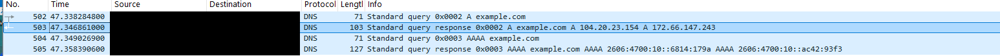

# Observing a DNS lookup with Wireshark

## Purpose
I used Wireshark in a guided home-lab exercise to observe my computer looking up the IP addresses for example.com. My aim was to identify the DNS request and response and understand what they showed.

## Method
1. I started a capture on my active network connection in Wireshark.
2. I ran `nslookup example.com` in the Windows command prompt.
3. I stopped the capture and applied the display filter `dns`.
4. I narrowed the results using `dns.qry.name == "example.com"` and inspected the response details.

## Capture screenshot

*Original screenshot cropped to the filtered packet list. Source and destination addresses are covered by opaque black boxes; the lower device-details and raw-byte panes are excluded. Visible packet numbers and DNS details are unchanged.*

## Evidence and findings
The capture showed four packets for the lookup:

| Packet | Observation |
| --- | --- |
| 502 | My computer sent an A query for example.com, requesting IPv4 addresses. |
| 503 | The DNS server responded with two IPv4 addresses: 104.20.23.154 and 172.66.147.243. |
| 504 | My computer sent an AAAA query for example.com, requesting IPv6 addresses. |
| 505 | The DNS server returned an IPv6 response. |

The source and destination addresses reversed between the request and response. Wireshark also identified the reply as a DNS response.

These observations come from the screenshots of my captured traffic. The original capture file is not included with this write-up. The returned addresses describe this capture, not necessarily a future lookup.

## Conclusion
The capture showed that my computer received DNS answers associating example.com with IP addresses. It did not prove that my computer opened the website or that the website was safe. A DNS answer also does not establish ownership of an IP address.

## What I learned
DNS looks up addresses associated with a domain name. A lookup, a connection to a website, and a download are separate events requiring separate evidence. I also practised filtering traffic and distinguishing requests from responses.

## Scope
This was a guided learning exercise on my own computer, not an investigation of a confirmed security incident. I received assistance with the steps, interpretation, and wording of this report. No malicious activity was established by this exercise.

## Public evidence companion
The [public evidence table](DNS-public-evidence.md) provides selected packet observations using endpoint roles instead of device addresses. Use that companion for sharing; the original screenshots contain additional device details and unrelated traffic and have not been edited.

